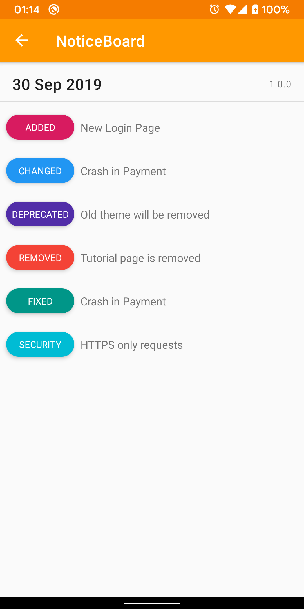
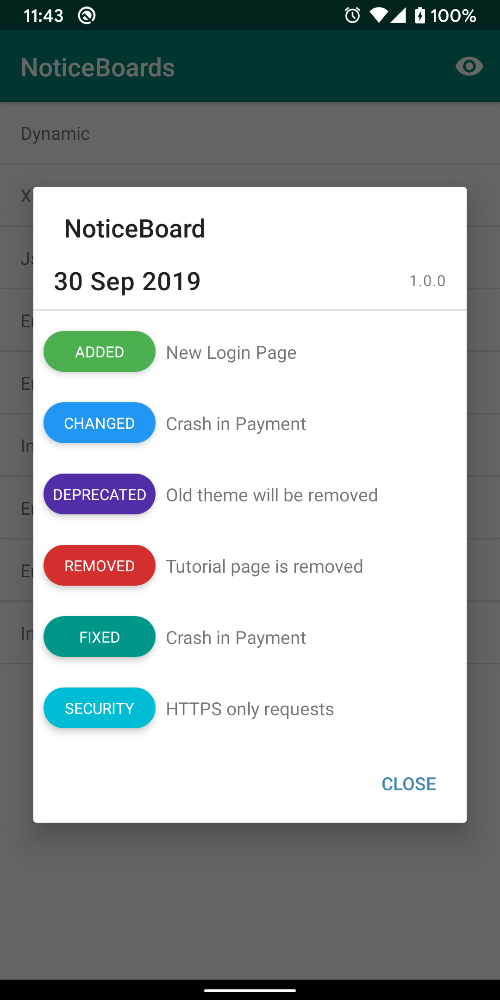

公告栏
-------

 


NoticeBoard是适用于Android API 21+的changelog库。它可以帮助开发人员显示其应用程序更改的历史记录。

它显示包含释放列表的“ Release”或“ UnRelease”列表。

它接收更改和配置的来源。

您可以在此存储库中找到NoticeBoard的示例代码。

`NoticeBoardSample` 应用现已在Google Play上，可以被下载。

<a href="https://play.google.com/store/apps/details?id=net.furkanakdemir.noticeboardsample"></a>
 


屏幕截图
-------


|活动|对话|
|----------|---------|
|||


下载
-------

```
dependencies {
    implementation "net.furkanakdemir:noticeboard:1.1.0"
}

```

使用方法
-------

`pin` 功能用于显示更改日志列表. 它接受一个 lambda，以使客户端配置其公告板.

以下是默认配置:  
TITLE: NoticeBoard  
DISPLAY_IN: Activity  
SOURCE_TYPE: Dynamic with empty list  


```java
NoticeBoard(this).pin {
    // configs
    title(...)
    displayIn(...)
    colorProvider(...)
    source(...)
}
```
`this` 可以是 `Fragment` 或 `Activity`

### 标题

公告栏的标题可以通过 `title` 功能设置.

```java
NoticeBoard(this).pin {
    title("Release Notes")
}
```

### 标题

公告栏的标题可以通过 `tag` 功能设置.  
更新后，可用于重置布告栏显示的数量。

```java
NoticeBoard(this).pin {
    tag(versionCode)
}
```

### 显示选项
NoticeBoard 可以两种方式显示.

显示选项  |
-----------------|
ACTIVITY             |
DIALOG             |

```java
NoticeBoard(this).pin {
    displayIn(ACTIVITY)
}
```

### 显示规则

布告栏的显示规则可以通过 `showRule` 功能设置.

Show Rules |
-----------|
Once       |
Always    |
Limited    |

```java
NoticeBoard(this).pin {
    showRule(Once)
    showRule(Always)
    showRule(Limited(3))
}
```

### 颜色提供者

可以传递颜色提供程序以提供更改类型背景。

覆盖默认的颜色提供程序


``` java
class CustomColorProvider(private val context: Context) : NoticeBoardColorProvider(context) {
    override var colorAdded: Int = R.color.colorAccent
    override var colorChanged: Int = R.color.colorAccent
    override var colorDeprecated: Int = R.color.colorPrimary
    override var colorRemoved: Int = R.color.colorPrimary
    override var colorFixed: Int = R.color.colorPrimaryDark
    override var colorSecurity: Int = R.color.colorPrimaryDark
    override var colorDescriptionText = R.color.colorDescriptionCustom
    override var colorBackground: Int = R.color.colorBackgroundCustom
    override var colorTitleDialog: Int = R.color.colorTitleCustom
    override var colorTitleActivity: Int = R.color.colorTitleCustom
}
```

或实现 `ColorProvider` 接口

```java
class CustomColorProvider : ColorProvider {
    override fun getChangeTypeBackgroundColor(changeType: ChangeType): Int {

    }

    override fun getBackgroundColor(): Int {

    }

    override fun getDescriptionColor(): Int {

    }

    override fun getTitleColor(displayOptions: DisplayOptions): Int {

    }
}

```

最后，可以通过 `colorProvider` 功能设置自定义颜色提供程序.

```java
val customColorProvider = CustomColorProvider(this)

NoticeBoard(this).pin {
    colorProvider(customColorProvider)
}

```

### 未发行部分  

可以将未发布的部分添加到布告栏。

`UnRelease`  可以动态创建

或者 

`released` 在JSON或XML文件中，字段可以设置为false。（默认值：true）

可以配置未发布部分的位置。（默认：TOP）

Position  |
----------|
TOP       |
BOTTOM    |
NONE      |

如果选择 `TOP` 或 `BOTTOM` , 所有未发布的项目将合并到一个列表中.  
如果 `NONE` 被选择, 则项目保持原样.  


```java
NoticeBoard(this).pin {
    unreleasedPosition(BOTTOM)
}

```

### 变更类型

当前有6种内置的更改类型。

变更类型 | 枚举
------------|------------
ADDED       |0
CHANGED     |1
DEPRECATED  |2
REMOVED     |3
FIXED       |4
SECURITY    |5

### 来源类型

当前有3种数据源类型。

资源  |
--------|
Dynamic |
Json    |
Xml     |

#### 动态

通过动态创建来保存版本

```java
val changes = listOf(
            Release("30 Sep 2019", "1.0.0",
                listOf(
                    Change("New Login Page", ADDED),
                    Change("Toolbar in Checkout", CHANGED),
                    Change("Old theme will be removed", DEPRECATED),
                    Change("Tutorial page is removed", REMOVED),
                    Change("Crash in Payment", FIXED),
                    Change("HTTPS only requests", SECURITY)
                )
            )
        )

NoticeBoard(this).pin {
    source(Dynamic(changes))
}
```


#### Json

通过在 `/assets` 文件夹中创建一个json文件来存储发行版.

这是JSON文件的示例
```json
[
  {
    "date": "30 Sep 2019",
    "version": "1.0.0",
    "released": true,
    "changes": [
      {
        "type": 0,
        "description": "New Login Page"
      },
      {
        "type": 1,
        "description": "Toolbar in Checkout"
      },
      {
        "type": 2,
        "description": "Old theme will be removed"
      },
      {
        "type": 3,
        "description": "Tutorial page is removed"
      },
      {
        "type": 4,
        "description": "Crash in Payment"
      },
      {
        "type": 5,
        "description": "HTTPS only requests"
      }
    ]
  }
]
```


```java
val filepath = "sample.json"

NoticeBoard(this).pin {
    source(Json(filepath))
}
```

#### Xml

通过在`/assets` 文件夹中创建一个xml文件来存储发行版

这是XML文件的示例
```xml
<?xml version="1.0" encoding="UTF-8" ?>
<releases>
    <release>
        <date>30 Sep 2019</date>
        <version>1.0.0</version>
        <released>true</released>
        <change>
            <description>New Login Page</description>
            <type>0</type>
        </change>
        <change>
            <description>Toolbar in Checkout</description>
            <type>1</type>
        </change>
        <change>
            <description>Old theme will be removed</description>
            <type>2</type>
        </change>
        <change>
            <description>Tutorial page is removed</description>
            <type>3</type>
        </change>
        <change>
            <description>Crash in Payment</description>
            <type>4</type>
        </change>
        <change>
            <description>HTTPS only requests</description>
            <type>5</type>
        </change>
    </release>
</releases>

```

```java
val filepath = "sample.xml"

NoticeBoard(this).pin {
    source(Xml(filepath))
}
```

即将来临
-------
1. 添加 `Known Issues` 部分的支持
2. 加自定义更改类型
3. 改良 `MarkdownDataSource`的支持 
4. 添加远程数据支持
5. 添加 GOTO 按钮
6. 新日期格式

贡献
-------
如果您在库或示例中发现错误，请提出一个新的 Issue。

鼓励使用补丁，可以通过分叉此项目并提交请求请求来提交补丁。

如果您有贡献，noticeboard但您的名字不在列表中，请随时添加您自己的名字！

- [Furkan Akdemir](https://github.com/furkanakdemir) - 维护者
- [Nuh Koca](https://github.com/nuhkoca) - 合作伙伴，CI改进单位


执照
-------

    Copyright 2019 Furkan Akdemir

    Licensed under the Apache License, Version 2.0 (the "License");
    you may not use this file except in compliance with the License.
    You may obtain a copy of the License at

       http://www.apache.org/licenses/LICENSE-2.0

    Unless required by applicable law or agreed to in writing, software
    distributed under the License is distributed on an "AS IS" BASIS,
    WITHOUT WARRANTIES OR CONDITIONS OF ANY KIND, either express or implied.
    See the License for the specific language governing permissions and
    limitations under the License.
