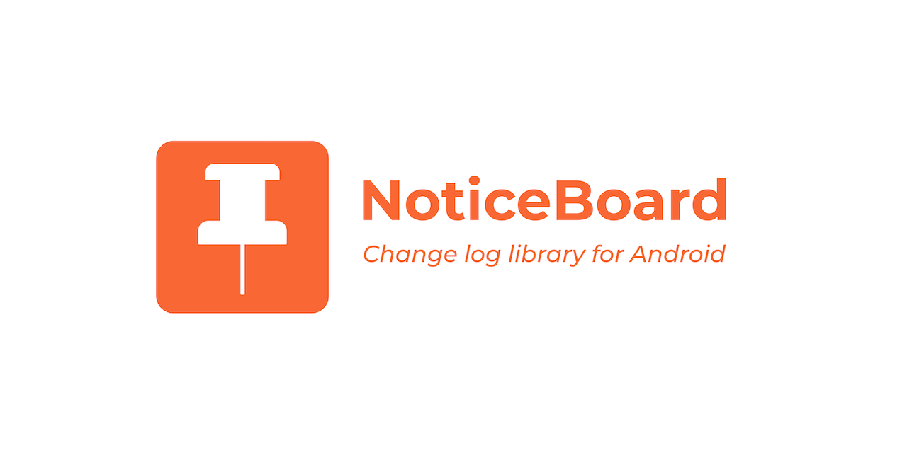

# NoticeBoard


NoticeBoard is a changelog library for Android API 21+.


## Screenshot


## Download


```
dependencies {
    implementation "net.furkanakdemir:noticeboard:1.0.0"
}

```

## Usage


Basic usage is the following

```java
NoticeBoard(this).pin {
    ... // configs
}
```

#### Title

The title of a noticeboard can be set by

```java
NoticeBoard(this).pin {
    title("Release Notes")
}
```


#### Display Options

NoticeBoard can be displayed in two ways


Display Options  |
-----------------|
ACTIVITY         |
DIALOG           |


```java
NoticeBoard(this).pin {
    displayIn(ACTIVITY)
}
```

#### Color Provider

A color provider can be passed to change change type backgrounds.

Override the default color provider


```java
class CustomColorProvider(private val context: Context) : NoticeBoardColorProvider(context) {
    override var colorAdded: Int = ContextCompat.getColor(context, R.color.colorAccent)
}

```

or

Implement `ColorProvider` interface

```java
class CustomColorProvider : ColorProvider {
    override fun getChangeTypeBackgroundColor(changeType: ChangeType): Int {

    }
}

```
Finally

```java
val customColorProvider = CustomColorProvider(this)

NoticeBoard(this).pin {
    colorProvider(customColorProvider)
}

```

#### Source Types
There are currently 3 data source types.

Source  |
--------|
Dynamic |
Json    |
Xml     |

##### Dynamic

You can add releases programmatically

```java
val changes = listOf(
            Release("30 Sep 2019", "1.0.0",
                listOf(
                    Change("New Login Page", ADDED),
                    Change("Crash in Payment", CHANGED),
                    Change("Old theme will be removed", DEPRECATED),
                    Change("Tutorial page is removed", REMOVED),
                    Change("Crash in Payment", FIXED),
                    Change("HTTPS only requests", SECURITY)
                )
            )
        )

val myColorProvider = CustomColorProvider(this)

NoticeBoard(this).pin {
    source(Dynamic(changes))
}
```

##### Json

You can add releases by adding json file to `/assets` folder.

JSON format

```json
[
  {
    "date": "30 Sep 2019",
    "version": "1.0.0",
    "changes": [
      {
        "type": 0,
        "description": "New Login Page"
      },
      {
        "type": 1,
        "description": "Crash in Payment"
      },
      {
        "type": 2,
        "description": "Old theme will be removed"
      },
      {
        "type": 3,
        "description": "Tutorial page is removed"
      },
      {
        "type": 4,
        "description": "Crash in Payment"
      },
      {
        "type": 5,
        "description": "HTTPS only requests"
      }
    ]
  }
]
```


```java
val filepath = "sample.json"

NoticeBoard(this).pin {
    source(Json(filepath))
}
```

##### Xml

You can add releases by adding xml file to `/assets` folder.

XML  format
```xml
<?xml version="1.0" encoding="UTF-8" ?>
<releases>
    <release>
        <date>30 Sep 2019</date>
        <version>1.0.0</version>
        <change>
            <description>New Login Page</description>
            <type>0</type>
        </change>
        <change>
            <description>Crash in Payment</description>
            <type>1</type>
        </change>
        <change>
            <description>Old theme will be removed</description>
            <type>2</type>
        </change>
        <change>
            <description>Tutorial page is removed</description>
            <type>3</type>
        </change>
        <change>
            <description>Crash in Payment</description>
            <type>4</type>
        </change>
        <change>
            <description>HTTPS only requests</description>
            <type>5</type>
        </change>
    </release>
</releases>

```

```java
val filepath = "sample.xml"

NoticeBoard(this).pin {
    source(Xml(filepath))
}
```

## Upcoming


1. Add `Unreleased` section support
2. Add `Known Issues` section support
3. Add showing rules ( only once, always )
4. Add a custom change types
5. Add `MarkdownDataSource` support
6. Add remote data support
7. Add a GOTO button
8. Enhance Color API
9. New Date formats

License
-------

    Copyright 2019 Furkan Akdemir

    Licensed under the Apache License, Version 2.0 (the "License");
    you may not use this file except in compliance with the License.
    You may obtain a copy of the License at

       http://www.apache.org/licenses/LICENSE-2.0

    Unless required by applicable law or agreed to in writing, software
    distributed under the License is distributed on an "AS IS" BASIS,
    WITHOUT WARRANTIES OR CONDITIONS OF ANY KIND, either express or implied.
    See the License for the specific language governing permissions and
    limitations under the License.
